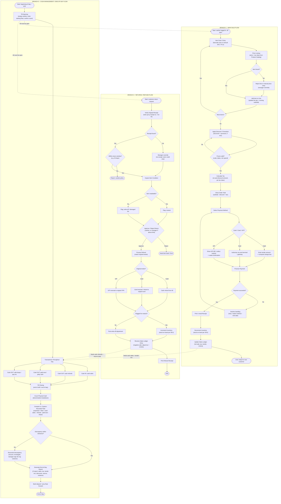

# POS / EPOS — End-to-End Transaction Workflow

**Phase 1 of 3** · Workflow design for a single-store retail business
**Status:** draft for review — feeds Phase 2 (HTML mockup) and Phase 3 (full-stack build)

---

## Scope & assumptions

| Area | Assumption |
|---|---|
| Business | One physical store, one or a few POS lanes, shared central catalog + inventory |
| Market | India-style retail: INR, tax classes (GST-like), **UPI as a first-class tender** alongside Cash and Card |
| Roles | **Cashier** (runs sales/returns), **Shift Manager** (approves overrides, signs off variance) |
| Payments | Modelled as integrated tender flows. Actual card/UPI gateway is **sandbox/mock** in the build — the workflow is real, the settlement is simulated |
| Inventory | Single stock-on-hand figure per SKU; sale decrements, approved resaleable return increments |
| Ledger | Every sale and refund posts a line: net amount, tax, tender, COGS. Refund posts the reversal |

---

## The workflow

---

## One-line explanation per branch

**Branch 1 — Main Sale Flow:** the cashier builds a cart item by item, the system prices and taxes it after any promotion, the customer pays by Cash / Card / UPI, and only on a successful payment does the POS print the receipt, decrement stock, and post the sale to the ledger.

**Branch 2 — Returns / Refund Flow:** a return is validated against its original receipt and return window, the item is inspected and approved, the refund is issued back on the *same* tender used to pay, and inventory plus the sales ledger are adjusted in reverse (restock or write-off).

**Branch 3 — Cash Management / End-of-Day Flow:** the till opens with a counted float, every cash movement in and out is tracked through the day, then at close the drawer is physically counted and compared to the system's expected figure, any variance is reconciled and signed off, and a Z-report closes the day.

---

## Key decision points & business rules

| # | Decision | Rule (default — configurable in Phase 3) |
|---|---|---|
| S3 | Item not found | Block the line; manager override allows a manual-price line item |
| S7 | Promo invalid | Reject code; sale continues at full price |
| S11 | Tender type | Cash / Card / UPI; split tender allowed (repeat S10–S14 per part) |
| S14 | Payment failed | Max 3 retries, then switch method or void the whole sale — nothing posts |
| R2 | No receipt | Manager override only; refund becomes **store credit**, never cash |
| R3 | Return window | 30 days from sale date |
| R5 | Item resaleable | Cashier judgement; sets the restock-vs-write-off flag |
| R7 | Approval limit | Cashier can approve up to ₹2,000; above that needs Shift Manager |
| R9 | Refund tender | Must match original tender; cash refund only if original was cash |
| C10 | Cash variance | Tolerance ±₹100; outside that triggers mandatory reconciliation + sign-off |

---

## What is real vs. simulated

| Real (modelled properly) | Simulated / mocked |
|---|---|
| Catalog lookup, pricing, tax-class calculation | Card terminal + UPI PSP — sandbox responses, no real settlement |
| Discount / promotion validation logic | Bank deposit step — recorded, not integrated |
| Inventory decrement / increment, write-off path | Receipt printer / email — preview + log, no hardware driver |
| Sales ledger postings and reversals | |
| Till float, cash movements, expected-vs-counted reconciliation, Z-report | |

---

## Next phase

Phase 2 turns this into a click-through **HTML/CSS/JS mockup** (vanilla + LocalStorage) with three tabs — **Sale**, **Returns**, **Till / Cash Management** — mirroring the three branches above so state persists across tabs like a real prototype.
